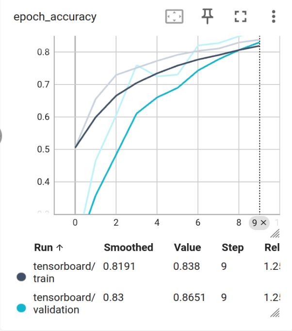
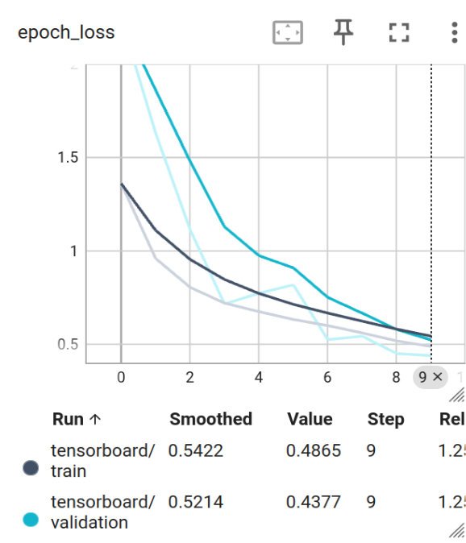
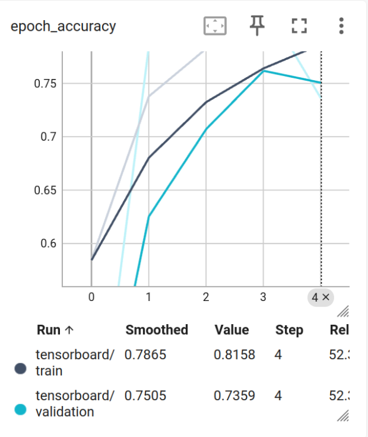
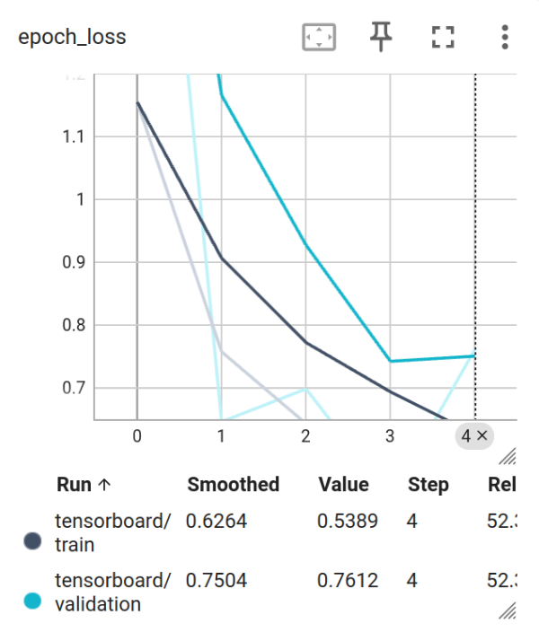

# Analysis Report – Dungeon Archivist

## Overview
The goal of the Dungeon Archivist project is to automatically organize a large collection of game asset images whose original folder structure was lost. Using a convolutional neural network (CNN) and a vector database, the system learns visual representations of assets and restores order by grouping similar items together.

This analysis documents:
- Model architecture and training setup
- Use of embeddings and vector similarity
- Results of applying the model to chaotic datasets
- The impact of expanding the training data with auto-sorted assets

---

## Phase 1: Model Training (Dataset A)

### Model Architecture
The vision model is a lightweight CNN designed for 32×32 RGB images and CPU-safe execution. It consists of:

- Multiple convolutional blocks with increasing channel depth (48 → 64 → 96)
- Batch normalization and ReLU activations for stable training
- Max pooling and dropout for regularization
- Global average pooling to reduce parameters and improve generalization
- A dense embedding layer (128-dimensional) used for vector similarity search
- A softmax output layer for supervised classification

The embedding layer serves as the core representation for downstream similarity-based retrieval.

---

### Training Configuration
- **Optimizer:** Adam  
- **Loss Function:** Sparse Categorical Cross-Entropy  
- **Batch Size:** 32  
- **Epochs:** Up to 10  
- **Validation Split:** 20% (stratified to preserve class balance)  
- **Callbacks:**  
  - Early stopping (patience = 5, minimum delta = 0.01)  
  - TensorBoard logging for loss and accuracy tracking  

Early stopping ensures the model does not overfit the clean dataset and restores the best-performing weights.

---

## Phase 2: Embeddings and Vector Database

After training on Dataset A, embeddings are generated for every image using the model’s embedding layer.

### Vector Storage
- Embeddings are L2-normalized
- Stored in ChromaDB
- Cosine similarity is used for nearest-neighbor search

Each embedding is stored with metadata containing its ground-truth label. This allows the system to retrieve visually similar items and reason about likely categories for unseen assets.

---

## Phase 3: Restoration of Chaos (Dataset B)

Dataset B contains unlabeled, disorganized images. For each image:

1. The trained model generates an embedding
2. The embedding is queried against the vector database
3. The top-k nearest neighbors are retrieved
4. A weighted voting strategy (similarity-weighted softmax) determines the predicted label
5. A confidence score is computed

If the confidence exceeds a predefined threshold, the image is automatically moved into a restored folder corresponding to the predicted category. Otherwise, it is placed into a review pile for manual inspection.

This approach balances automation with caution, reducing the risk of confidently incorrect classifications.

---

## Phase 4: Expansion Analysis (Dataset A + B)

Once Dataset B has been auto-sorted, it effectively becomes additional labeled data (with some noise). The model can then be retrained on the combined Dataset A + Dataset B.

### Observed Impact
- Increased data diversity improves robustness
- Embeddings become more stable and semantically meaningful
- The system is able to confidently auto-restore a larger portion of assets
- Validation accuracy and loss curves show more stable convergence

While raw validation accuracy may only improve modestly, the practical performance of the system improves in terms of confidence and coverage, which is more important for the archivist use case.

---

## Evaluation Strategy

- **Validation accuracy** is measured using labeled data during training
- **Test/Demo data** is intentionally excluded from accuracy calculations to avoid data leakage
- Performance on demo data is evaluated qualitatively by observing successful restoration behavior

This mirrors real-world ML workflows where test data is reserved strictly for inference.

---

## Accuracy & Loss Comparison
### Before (Only Dataset A)

|  |  |
|----------------------------------------------------------------------------|

### After (Dataset A + sorted Dataset B)

|  |  |
|-----------------------------------------------------------------------------|

---

## Conclusion

The Dungeon Archivist successfully demonstrates how supervised learning and vector similarity search can be combined to restore structure to disorganized data. By separating classification from retrieval through an embedding-based design, the system generalizes beyond the initial labeled dataset.

Adding auto-sorted data improves the model’s robustness and confidence, even when labels are imperfect. This confirms that the expansion strategy is effective and aligns with the project’s goal of scalable, automated archival.

---

## Key Takeaways
- Embedding-based architectures enable flexible similarity-driven classification
- Vector databases are effective for handling unlabeled or weakly labeled data
- Confidence-aware automation is critical when working with noisy datasets
- Practical performance is defined by robustness and coverage, not accuracy alone
